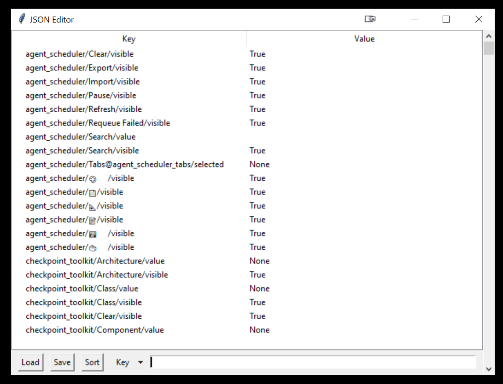

# GUI json editor

## **ALWAYS MAKE A BACKUP BEFORE EDITING YOUR JSON FILE.** 
## **I TAKE NO RESPONSIBILITY FOR THINGS GETTING BORKED.**

## What do
Lets you edit `.json` files with a GUI instead of a text editor (bleck).

Primarily made for `A1111`, but should work on other things.

## Features
- Double-click a `value` to change it. **BE SURE TO PRESS ENTER AFTER CHANGING A VALUE**
- Search by `key` or `value`
- Remembers your last opened `.json` file
- Extremely robust saving system (3 options, lmao)
- Doesn't bork anything (hopefully)
  
## How to run

- Install [Python 3.10.x](https://www.python.org/downloads/release/python-3109/)
- `git clone https://github.com/remghoost/gui-json-editor`
- `run.bat`

## Things that don't work / to add
- Sorting
- Sometimes searching (think I fixed that)
- Backup original `.json` before saving
- Edge cases

### Didn't that one person make this already....?
Probably. Idk. Wanted to edit `adetailer` defaults and didn't see an easy way to do that.